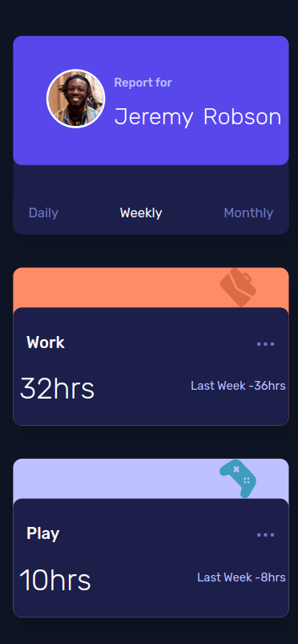

# Frontend Mentor - Time tracking dashboard solution

This is a solution to the [Time tracking dashboard challenge on Frontend Mentor](https://www.frontendmentor.io/challenges/time-tracking-dashboard-UIQ7167Jw). Frontend Mentor challenges help you improve your coding skills by building realistic projects. 

## Table of contents

- [Overview](#overview)
  - [The challenge](#the-challenge)
  - [Screenshot](#screenshot)
  - [Links](#links)
- [My process](#my-process)
  - [Built with](#built-with)
  - [Code Snippets](#code-snippets)
  - [Useful resources](#useful-resources)
- [Author](#author)


## Overview

### The challenge

Users should be able to:

- View the optimal layout for the site depending on their device's screen size
- See hover states for all interactive elements on the page
- Switch between viewing Daily, Weekly, and Monthly stats

### Screenshot




### Links

- [Soluition URL](https://your-solution-url.com)
- [Live Site URL](https://cipivlad.github.io/time_tracking_dashboard/)

## My process

### Built with

- Semantic HTML5 markup
- Flexbox
- Grid
- Layout - First Approach
- [React](https://react.dev) - JS library
- Typescript
- vite


### Code Snippets

#### using a card component for conditionally rendering data when taking props from parent components

```js


import '../scss/ActivityCard.scss'
import { Data } from '../assets/data'


type OptionTimeFrameProps = {
    optionTimeFrame: string
}

const ActivityCard = (props: Data & OptionTimeFrameProps) => {
    const { timeframes } = props

    return (
        <div className="activity_container">
            <div className="activity_heading_flexbox">
                <p className='activity'>{props.title}</p>
                <div className='three_dots'>...</div>
            </div>
            <div className="activity_time_flex_container">
                <h2 className="activity_time">
                    {
                        props.optionTimeFrame === 'Daily'
                            ? timeframes.daily.current
                            : props.optionTimeFrame === 'Weekly'
                                ? timeframes.weekly.current
                                : timeframes.monthly.current
                    }hrs
                </h2>
                <p className="activity_previous">Last Week -
                    {
                        props.optionTimeFrame === 'Daily'
                            ? timeframes.daily.previous
                            : props.optionTimeFrame === 'Weekly'
                                ? timeframes.weekly.previous
                                : timeframes.monthly.previous
                    }hrs</p>
            </div>
        </div>
    )
}
export default ActivityCard
```
#### parent component spreading data to card

```js

                {/* activity cards */}
                <div className="work_card_bg">
                    
                    {Work &&
                        <ActivityCard
                            {...Work}
                            timeframes={Work.timeframes}
                            optionTimeFrame={optionTimeFrame || chooseTimeFrame[0]}
                        />}
                </div>
                <div className="play_card_bg"> ...
```


### Continued development

Grid and Flex are such a great help during the devloping process... there's still so much to learn about it. I'm enjoying the process!

### Useful resources

- [Grid Generator](https://grid.layoutit.com/) - This helped me diving deeper in CSS - Flex and Grid Box and figuring grid areas out.
- [CSS - Tricks](https://css-tricks.com/) - This is an amazing site which always helped me styling apps. I'd recommend it to anyone learning css.


## Author

- Website - [Portfolio](https://cipivlad.github.io/myportfoliosite/)
- Frontend Mentor - [@CipiVlad](https://www.frontendmentor.io/profile/CipiVlad)
- DEV.to [https://dev.to/cipivlad](https://dev.to/cipivlad)

## Tags

#react, #typescript, #scss, #vite, #github, #grid, #flexbox